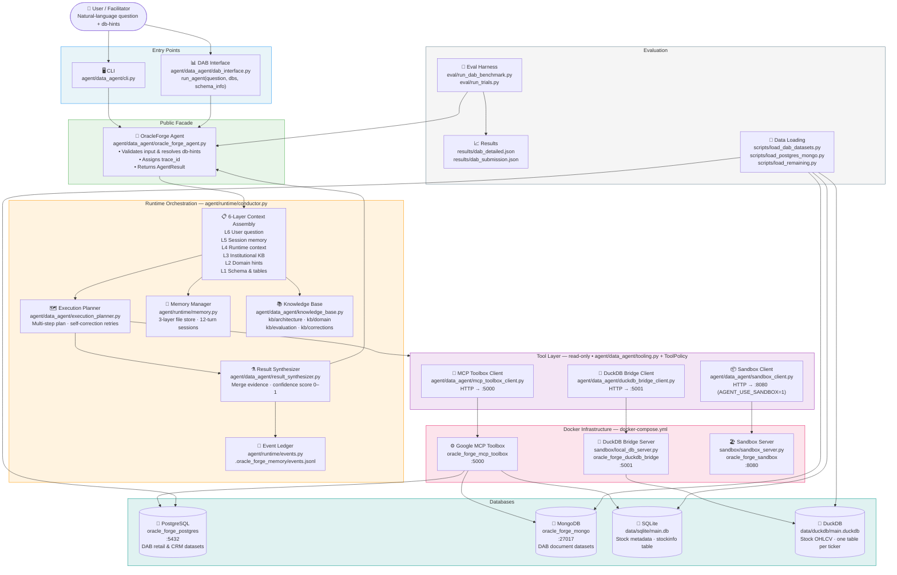

# OracleForge Data Analytics Agent

Production-grade multi-database analytics agent for the TRP1 Oracle Forge challenge.  
Answers natural-language data questions by routing queries across PostgreSQL, MongoDB, SQLite, and DuckDB through a unified MCP tool interface.

## Team Roster and Roles
- Drivers: Nurye, Kemerya
- Intelligence Officers: Amare, Ephrata
- Signal Corps: Yohanis, Addisu

## Live Agent Access (Shared Server)
- Public live endpoint: `https://oracle-forge-sandbox.yohannesdereje1221.workers.dev/`
- Shared-server health endpoint: `http://YOUR_SHARED_SERVER_HOST:8080/health`
- Query endpoint (CLI over SSH on shared host):
  - `python3 -m agent.data_agent.cli "What was the maximum adjusted closing price in 2020 for The RealReal, Inc.?" --db-hints '["sqlite","duckdb"]'`

Replace `YOUR_SHARED_SERVER_HOST` with your team's shared-server host/IP before final submission (public endpoint above is already live).

---

## End-to-End Architecture



### Database Routing

| Question Domain | Tool | Database | Key Tables |
|----------------|------|----------|-----------|
| Stock prices, OHLCV, volume, Adj Close | `query_duckdb` | DuckDB | One table per ticker (e.g. `AAPL`, `MSFT`) |
| Stock metadata, company names, exchange | `query_sqlite` | SQLite | `stockinfo` |
| Retail, CRM, and other DAB datasets | `query_postgresql` | PostgreSQL | DAB-loaded tables |
| Document-store DAB datasets | `query_mongodb` | MongoDB | DAB collections |

### Operational Modes

| Env Var | Effect |
|---------|--------|
| `AGENT_USE_MCP=1` | Use live MCP tools (default) |
| `AGENT_USE_SANDBOX=1` | Route code execution through sandbox server |
| `AGENT_OFFLINE_MODE=1` | Stub LLM — no API calls, deterministic output |

---

## Architecture (Component Map)
- Public facade: `agent/data_agent/oracle_forge_agent.py`
- Runtime orchestration: `agent/runtime/conductor.py`
- Unified DB client: `agent/data_agent/mcp_toolbox_client.py`
- DuckDB bridge client: `agent/data_agent/duckdb_bridge_client.py`
- Context layering + KB retrieval: `agent/data_agent/context_layering.py`, `agent/data_agent/knowledge_base.py`
- Execution planning + failure diagnostics: `agent/data_agent/execution_planner.py`, `agent/data_agent/failure_diagnostics.py`
- Result synthesis: `agent/data_agent/result_synthesizer.py`
- Memory + event ledger: `agent/runtime/memory.py`, `agent/runtime/events.py`
- Optional sandbox execution path: `agent/data_agent/sandbox_client.py`, `sandbox/sandbox_server.py`
- DuckDB bridge server: `sandbox/local_db_server.py`
- Data loading scripts: `scripts/load_dab_datasets.py`, `scripts/load_postgres_mongo.py`, `scripts/load_remaining.py`

## Clean-Machine Setup (Facilitator Runbook)
1. Clone the repository.
```bash
git clone <repo-url>
cd data-analytics-agent
```
2. Create and activate Python environment.
```bash
python3 -m venv .venv
source .venv/bin/activate
pip install -r requirements.txt
```
3. Copy environment template.
```bash
cp .env.example .env
```
4. Start local infra stack.
```bash
docker compose -f docker-compose.yml up -d
./scripts/healthcheck_stack.sh
```
5. Run one agent query end-to-end.
```bash
python3 -m agent.data_agent.cli \
  "What was the maximum adjusted closing price in 2020 for The RealReal, Inc.?" \
  --db-hints '["sqlite","duckdb"]'
```
6. Run tests.
```bash
python3 -m unittest discover -s tests -v
```
7. Run evaluation harness baseline.
```bash
python3 eval/run_trials.py --trials 2 --output results/smoke.json
python3 eval/score_results.py --results results/smoke.json
```

## Non-Obvious Dependency and Environment Assumptions
- Docker Compose v2 is required (`docker compose`, not legacy `docker-compose`).
- `external/DataAgentBench` must exist locally because eval scripts read benchmark query folders directly.
- If `external/DataAgentBench` is missing, clone it:
```bash
git clone https://github.com/ucbepic/DataAgentBench.git external/DataAgentBench
```

## DAB-Compatible Function Interface
`agent/data_agent/dab_interface.py` provides:

```python
run_agent(question: str, available_databases: list[dict], schema_info: dict) -> dict
```

## Repository Deliverables Map
- Agent code: `agent/`
- Knowledge base: `kb/`
- Evaluation harness: `eval/`
- Adversarial probes: `probes/probes.md`
- Planning/governance docs: `planning/`
- Signal/communication artifacts: `signal/`
- Benchmark outputs + score log: `results/`
- Shared utility modules: `utils/`
