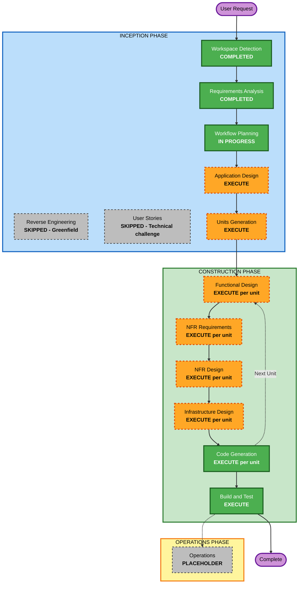

# Execution Plan
# The Oracle Forge — Data Analytics Agent

**Date**: 2026-04-11  
**Version**: 1.0

---

## Detailed Analysis Summary

### Change Impact Assessment
- **User-facing changes**: Yes — FastAPI `/query` endpoint is the primary user interface
- **Structural changes**: Yes — entirely new system with 5 major components
- **Data model changes**: Yes — new schema for query traces, KB documents, score logs
- **API changes**: Yes — new REST API + MCP Toolbox tool definitions
- **NFR impact**: Yes — Security (15 rules, blocking) + PBT (10 rules, blocking) both enabled

### Risk Assessment
- **Risk Level**: High
- **Rollback Complexity**: Moderate (greenfield, no existing code to break)
- **Testing Complexity**: Complex (multi-DB integration, LLM calls, benchmark evaluation)
- **Key Risks**:
  - OpenRouter/GPT-4o API reliability for benchmark runs (50 trials × 54 queries = 2,700 LLM calls)
  - MCP Toolbox binary configuration for 4 database types
  - DAB submission format compliance
  - Tight deadline: Interim April 15 (4 days), Final April 18 (7 days)

---

## Units of Work

This project is decomposed into **5 units** to enable parallel development and clear ownership:

| Unit | Name | Priority | Dependency |
|---|---|---|---|
| U1 | Agent Core & API | Critical | None |
| U2 | Multi-DB Execution Engine | Critical | U1 (partial) |
| U3 | Knowledge Base & Memory System | Critical | None |
| U4 | Evaluation Harness | High | U1, U2 |
| U5 | Utilities & Adversarial Probes | Medium | U1–U4 |

---

## Workflow Visualization

### Mermaid Diagram



### Text Alternative

```
INCEPTION PHASE:
  Workspace Detection        [COMPLETED]
  Reverse Engineering        [SKIPPED — Greenfield project]
  Requirements Analysis      [COMPLETED]
  User Stories               [SKIPPED — Technical challenge, no user personas]
  Workflow Planning          [IN PROGRESS]
  Application Design         [EXECUTE — 5 new components needed]
  Units Generation           [EXECUTE — 5 units of work]

CONSTRUCTION PHASE (per unit, 5 iterations):
  Functional Design          [EXECUTE — business logic design per unit]
  NFR Requirements           [EXECUTE — Security + PBT per unit]
  NFR Design                 [EXECUTE — security patterns + PBT framework]
  Infrastructure Design      [EXECUTE — DB connections, FastAPI, MCP]
  Code Generation            [EXECUTE — implementation per unit]
  Build and Test             [EXECUTE — comprehensive test suite]

OPERATIONS PHASE:
  Operations                 [PLACEHOLDER]
```

---

## Phases to Execute

### INCEPTION PHASE
- [x] Workspace Detection — COMPLETED
- [x] Reverse Engineering — SKIPPED (Greenfield)
- [x] Requirements Analysis — COMPLETED
- [ ] User Stories — **SKIP**
  - **Rationale**: Technical benchmark challenge. No distinct user personas. All users are developers running the agent against DAB.
- [x] Workflow Planning — IN PROGRESS
- [ ] Application Design — **EXECUTE**
  - **Rationale**: 5 new components with distinct service boundaries and inter-component contracts to define.
- [ ] Units Generation — **EXECUTE**
  - **Rationale**: 5 units of work require explicit decomposition and dependency mapping for parallel build.

### CONSTRUCTION PHASE (per each of 5 units)
- [ ] Functional Design — **EXECUTE** (per unit)
  - **Rationale**: Each unit has business logic (query planning, join resolution, scoring, KB retrieval) requiring detailed design.
- [ ] NFR Requirements — **EXECUTE** (per unit)
  - **Rationale**: Security (15 blocking rules) and PBT (10 blocking rules) both enabled. NFR stack selection needed per unit.
- [ ] NFR Design — **EXECUTE** (per unit)
  - **Rationale**: Security patterns (input validation, auth, logging, error handling) and PBT generators must be designed per unit.
- [ ] Infrastructure Design — **EXECUTE** (per unit)
  - **Rationale**: Each unit has distinct infrastructure needs (DB connections, MCP tools, FastAPI middleware, file storage).
- [ ] Code Generation — **EXECUTE** (per unit, ALWAYS)
- [ ] Build and Test — **EXECUTE** (ALWAYS)

### OPERATIONS PHASE
- [ ] Operations — PLACEHOLDER

---

## Recommended Stage Execution Order

```
1.  Application Design          (define 5 components + interfaces)
2.  Units Generation            (decompose into 5 build units)
3.  Unit 1: Agent Core & API
    3a. Functional Design
    3b. NFR Requirements
    3c. NFR Design
    3d. Infrastructure Design
    3e. Code Generation
4.  Unit 2: Multi-DB Engine
    4a–4e. Same sub-stages
5.  Unit 3: KB & Memory System
    5a–5e. Same sub-stages
6.  Unit 4: Evaluation Harness
    6a–6e. Same sub-stages
7.  Unit 5: Utilities & Probes
    7a–7e. Same sub-stages
8.  Build and Test              (all units integrated)
```

---

## Timeline Alignment with Challenge Deadlines

| Period | Primary Work | Target State |
|---|---|---|
| Apr 11 (today) | Application Design + Units Generation | Architecture decided |
| Apr 12–13 | U1 Agent Core + U2 Multi-DB Engine | Agent running locally, 2+ DB types |
| Apr 14 | U3 KB System + U4 Eval Harness | KB v1+v2, harness baseline score |
| Apr 15 21:00 UTC | **INTERIM SUBMISSION** | GitHub repo + PDF report |
| Apr 16–17 | U5 Utilities + probes, KB v3, full benchmark run | Score improving, 4 DB types |
| Apr 18 21:00 UTC | **FINAL SUBMISSION** | DAB PR + demo video + signal/ |

---

## Success Criteria

- **Primary Goal**: Produce a running data analytics agent that scores above baseline on DataAgentBench
- **Key Deliverables**: agent/, kb/, eval/, planning/, utils/, signal/, probes/, results/, README.md
- **Quality Gates**:
  - All Security rules compliant (blocking)
  - All PBT rules compliant (blocking)
  - Score log shows measurable improvement between first and final run
  - GitHub PR to ucbepic/DataAgentBench opened before April 18 21:00 UTC
